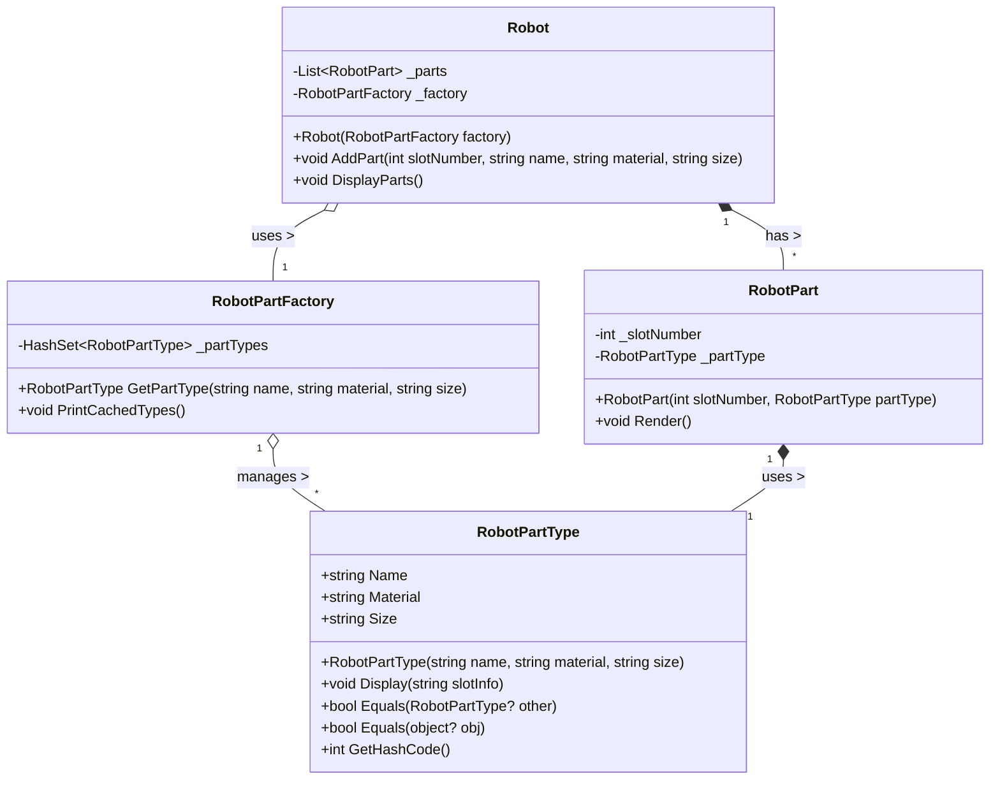
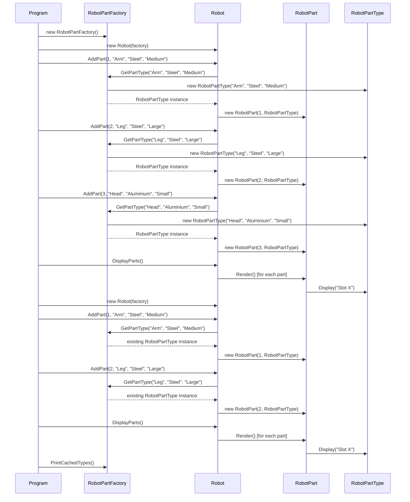

```mermaid
classDiagram
    class RobotPartType {
        +string Name
        +string Material
        +string Size
        +RobotPartType(string name, string material, string size)
        +void Display(string slotInfo)
        +bool Equals(RobotPartType? other)
        +bool Equals(object? obj)
        +int GetHashCode()
    }

    class RobotPartFactory {
        -HashSet~RobotPartType~ _partTypes
        +RobotPartType GetPartType(string name, string material, string size)
        +void PrintCachedTypes()
    }

    class RobotPart {
        -int _slotNumber
        -RobotPartType _partType
        +RobotPart(int slotNumber, RobotPartType partType)
        +void Render()
    }

    class Robot {
        -List~RobotPart~ _parts
        -RobotPartFactory _factory
        +Robot(RobotPartFactory factory)
        +void AddPart(int slotNumber, string name, string material, string size)
        +void DisplayParts()
    }

    %% Program.cs is the entry point, not a class, so it's not shown as a class.

    RobotPartFactory "1" o-- "*" RobotPartType : manages >
    RobotPart "1" *-- "1" RobotPartType : uses >
    Robot "1" *-- "*" RobotPart : has >
    Robot "1" o-- "1" RobotPartFactory : uses >
```

```mermaid
    sequenceDiagram
        participant Program
        participant RobotPartFactory
        participant Robot
        participant RobotPart
        participant RobotPartType

        %% Program starts
        Program->>RobotPartFactory: new RobotPartFactory()
        Program->>Robot: new Robot(factory)
        Program->>Robot: AddPart(1, "Arm", "Steel", "Medium")
        Robot->>RobotPartFactory: GetPartType("Arm", "Steel", "Medium")
        RobotPartFactory->>RobotPartType: new RobotPartType("Arm", "Steel", "Medium")
        RobotPartFactory-->>Robot: RobotPartType instance
        Robot->>RobotPart: new RobotPart(1, RobotPartType)
        Program->>Robot: AddPart(2, "Leg", "Steel", "Large")
        Robot->>RobotPartFactory: GetPartType("Leg", "Steel", "Large")
        RobotPartFactory->>RobotPartType: new RobotPartType("Leg", "Steel", "Large")
        RobotPartFactory-->>Robot: RobotPartType instance
        Robot->>RobotPart: new RobotPart(2, RobotPartType)
        Program->>Robot: AddPart(3, "Head", "Aluminium", "Small")
        Robot->>RobotPartFactory: GetPartType("Head", "Aluminium", "Small")
        RobotPartFactory->>RobotPartType: new RobotPartType("Head", "Aluminium", "Small")
        RobotPartFactory-->>Robot: RobotPartType instance
        Robot->>RobotPart: new RobotPart(3, RobotPartType)

        Program->>Robot: DisplayParts()
        Robot->>RobotPart: Render() [for each part]
        RobotPart->>RobotPartType: Display("Slot X")

        Program->>Robot: new Robot(factory)
        Program->>Robot: AddPart(1, "Arm", "Steel", "Medium")
        Robot->>RobotPartFactory: GetPartType("Arm", "Steel", "Medium")
        RobotPartFactory-->>Robot: existing RobotPartType instance
        Robot->>RobotPart: new RobotPart(1, RobotPartType)
        Program->>Robot: AddPart(2, "Leg", "Steel", "Large")
        Robot->>RobotPartFactory: GetPartType("Leg", "Steel", "Large")
        RobotPartFactory-->>Robot: existing RobotPartType instance
        Robot->>RobotPart: new RobotPart(2, RobotPartType)

        Program->>Robot: DisplayParts()
        Robot->>RobotPart: Render() [for each part]
        RobotPart->>RobotPartType: Display("Slot X")

        Program->>RobotPartFactory: PrintCachedTypes()
```        